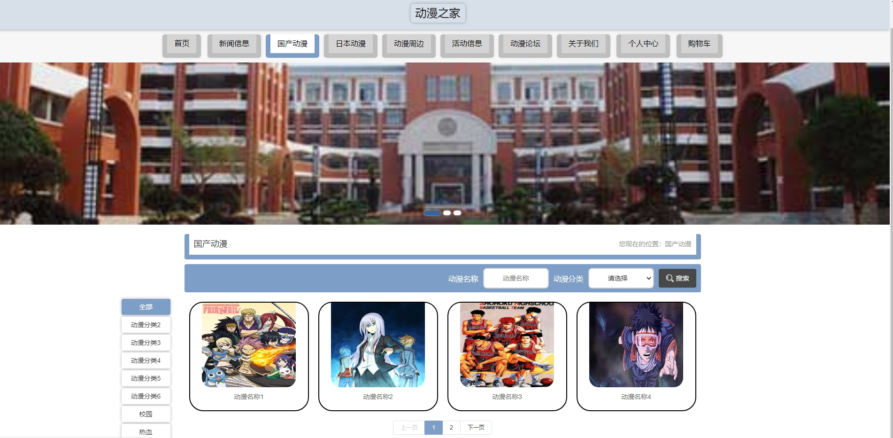
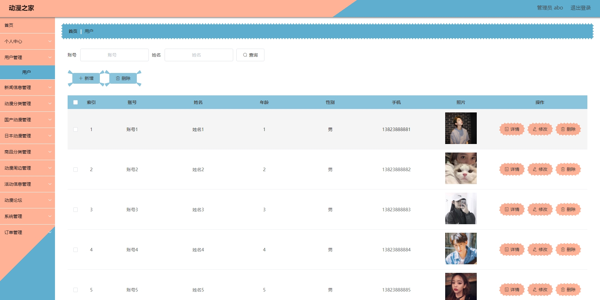
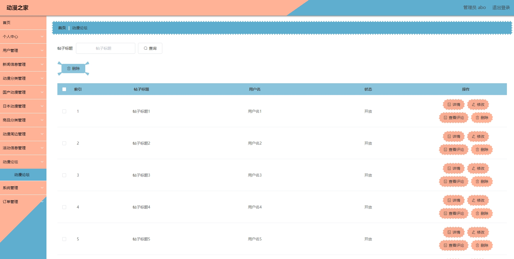
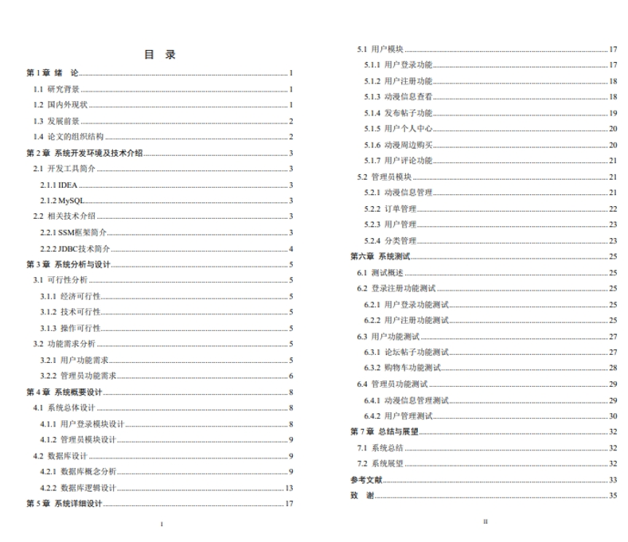

# 1.项目介绍
- 测试环境：idea2022，Tomcat8.5，MySQL5.7，Maven3,Navicat
- 技术栈：SSM，Druid，fastJson，Vue2

# 2.项目部署
- 通过Navicat创建数据库（可以自定义数据名字也可以和代码中jdbcUrl中的一致），导入项目内的数据库文件
- 通过IDEA导入项目，根据本地数据库环境，修改src/main/resources/config.properties下的3-5行
- 配置本地tomcat server，注意配置application context路径为/ssm5cu0v
- 启动项目
- 前端：http://localhost:8080/ssm5cu0v/front/index.html
- 后端管理web：http://localhost:8080/ssm5cu0v/admin/dist/index.html#/index

# 3.项目部分截图

# 4.获取方式
[戳我查看](https://gitee.com/aven999/mall)